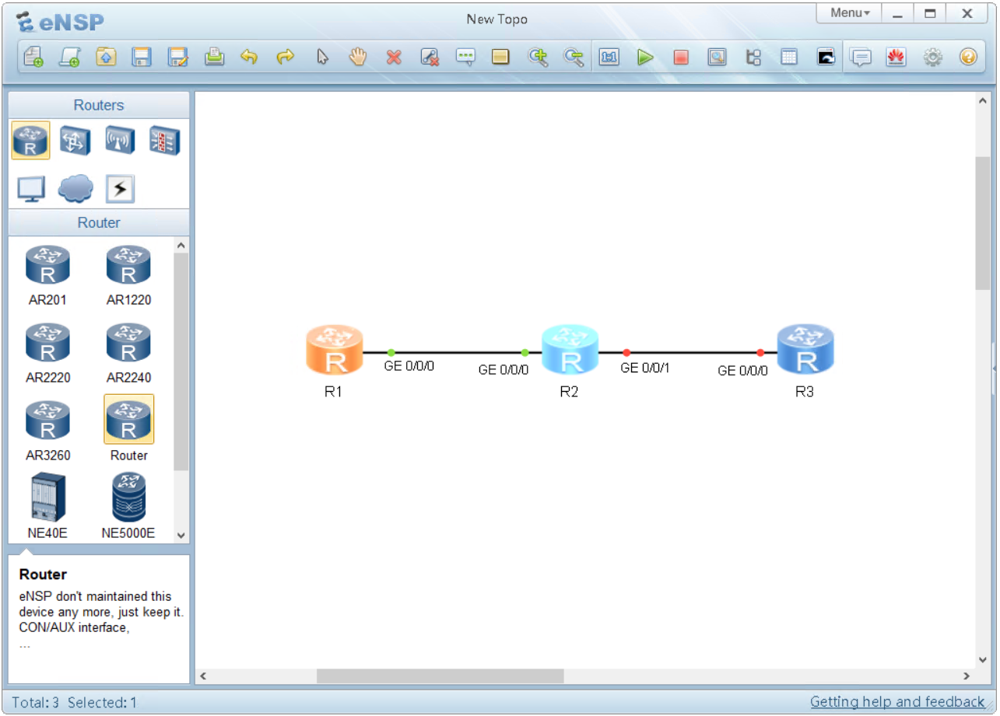
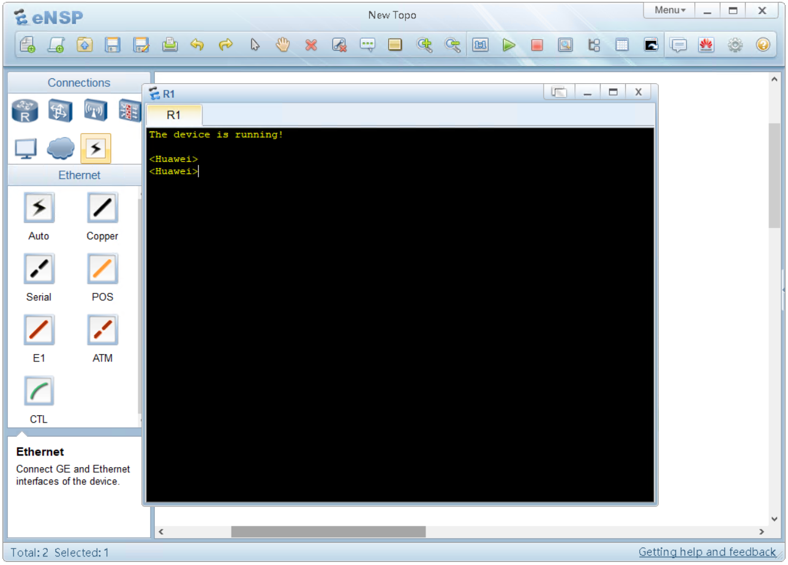

## Console

L'accesso console è il metodo principale con cui ti puoi collegare al dispsitivo, sia esso un router, uno switch o un'access point.
Abbiamo visto nel capitolo precedente le modalità fisiche di connessione tramite cavo console.

Su **eNSP** costruiamo il nostro primo laboratorio usando tre router, scegli il modello con il nome **Router**. Per essere chiari, il router nella colonna di sinistra nella terza riga.



R1 è di colore arancione perchè è stato selezionato.
R2 è di colore azzurro perchè e accesso.
R3 è di colore blu perchè NON è acceso.

Il link tra R1 e R2 ha i puntini verdi perchè il link è attivo tra i due router.
Il link tra R2 e R3 ha i puntini rossi perchè il link NON è attivo tra i due router poichè R3 è spento.

Fai doppio click sul router R1 per accedere alla console. 


## Lab 1
Prendiamo ora confidenza con i livelli delle viste.

Questo è il livello **user-view**, identificabile con i caratteri ai caratteri **<>**
```text
<huawei>
```

Con il comando **system-view** si passa alla vista system-view identificabile con i caratteri **[]**
```text
<huawei>system-view
[huawei]
```

Con il comando **interface GE0/0/0** si passa alla vista **interface-view** identificabile con **huawei-interface**.
```text
[huawei]interface GE0/0/0
[huawei-interface-GigabitEthernet0/0/0]
```

Con il comando **quit** si torna alla vista precedente
```text
[huawei-interface-GigabitEthernet0/0/0]quit
[huawei]
```

Scrivendo di nuovo **quit** si torna alla user-view
```text
[huawei]quit
<huawei>
```

È possibile utilizzare il comando **return** per tornare alla user-view da qualsiasi punto in cui ti trovi
```text
[huawei-interface-GigabitEthernet0/0/0]return
<huawei>
```

è possibile usare anche la combinazione di tasti **CTRL+Z** come scorciatoia del comando return
```text
[huawei-interface-GigabitEthernet0/0/0] **CTRL+Z**
<huawei>
```
