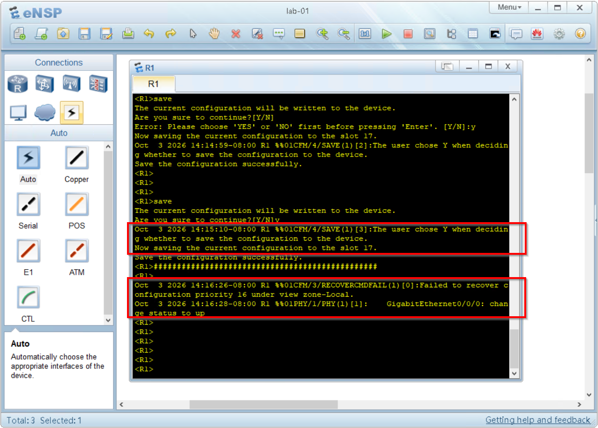
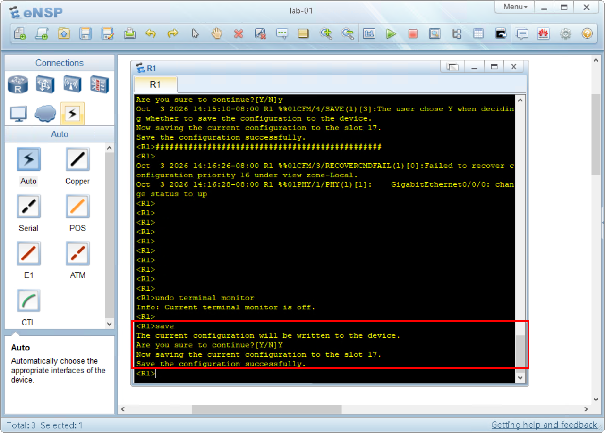

## Salvare la configurazione scritta nel dispositivo

Quando scrivi un comando su VRP, questa viene inserita in esecuzione nel runtime presente in **RAM**, ma non viene salvata automaticamente in memoria ritentiva **FLASH**.

Questo significa che al riavvio successivo quella configurazione non sarà presente.

Facciamo un semplice laboratorio per comprendere questo concetto:

Riprendi il lab01 realizzato nel modulo precedente in cui abbiamo parlato delle *user-view* e *system-view*.

Entra nel terminale di R1 (doppio click) e cambia il nome del router con questi due comandi:

```text
<huawei>system-view
[huawei]sysname R1
[R1]
```
Hai certamente notato che il nome del router è cambiato da "huawei" a "R1".

Ora chiudi il terminale e poi ferma il router.

Per fermare il router devi premere sul router con il pulsante destro del mouse, 
e dal menù selezionare **stop**.


Poi accendi il router


Attendi qualche istante per permettere al router di potersi avviare e accedi alla console.

Noterai che il nome del router sarà tornato a quello di default

```text
<huawei>
```

### Come salvare la configurazione sulla memoria FLASH

Per salvare la configurazione devi utilizzare il comando `save` dal menù *user-view*.

Assegna nuovamente il nome al router, e poi salva la configurazione.

```text
<huawei>system-view
[huawei]sysname R1
[R1]quit
<R1>save
The current configuration will be written to the device.
Are you sure to continue?[Y/N]
```
Conferma l'azione digitando **Y**
```text
Info: Please input the file name ( *.cfg, *.zip ) [vrpcfg.zip]:
```
Al primo salvataggio il router ti chiederà quale nome assegnare al fine di configurazione. Questa domanda non viene ripetuta per i salvataggi successivi.

Se non viene specificato un nome, verrà scelto il nome di default **vrpcfg.zip**. 

Conferma il nome di default premendo il pulsante **invio**.

```text
Now saving the current configuration to the slot 17.
Save the configuration successfully.
```

Ferma e fai ripartire il router con la procedura vista poco fa.

Al riavvio il router avrà mantenuto la configurazione.

Probabilmente ti sarai accorto che nel terminale compaiono delle scritte dopo aver digitato dei comandi.


Queste scritte vengono generate dal **terminal monitor** di VRP.

È possibile disabilitare il terminal monitor per disattivare questi messaggi.

### Come disattivare terminal monitor

Dalla vista *user-view* digita il comando `undo terminal monitor`

```text
<R1>undo terminal monitor
Info: Current terminal monitor is off.
```

Se ora proverai a salvare la configurazione con il comando `save` noterai che non verranno stampati i messaggi dal terminal monitor.



Molto meglio!
Tuttavia in alcune situazioni può tornare utile avere il terminal monitor attivo.
Potrai sempre riattivarlo con il comando `terminal monitor`

```text
<R1>terminal monitor
Info: Current terminal monitor is on.
```

Abbiamo imparato un'altra cosa nel frattempo: per annullare un comando si utilizza `undo` scritto prima del comando da annullare.

Esegui queste due esercitazioni:

Annulla terminal monitor
```text
<R1>undo terminal monitor
Info: Current terminal monitor is off.
```

Abilita terminal monitor
```text
<R1>terminal monitor
Info: Current terminal monitor is on.
```


