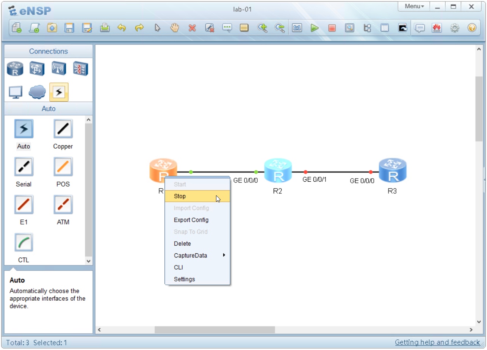
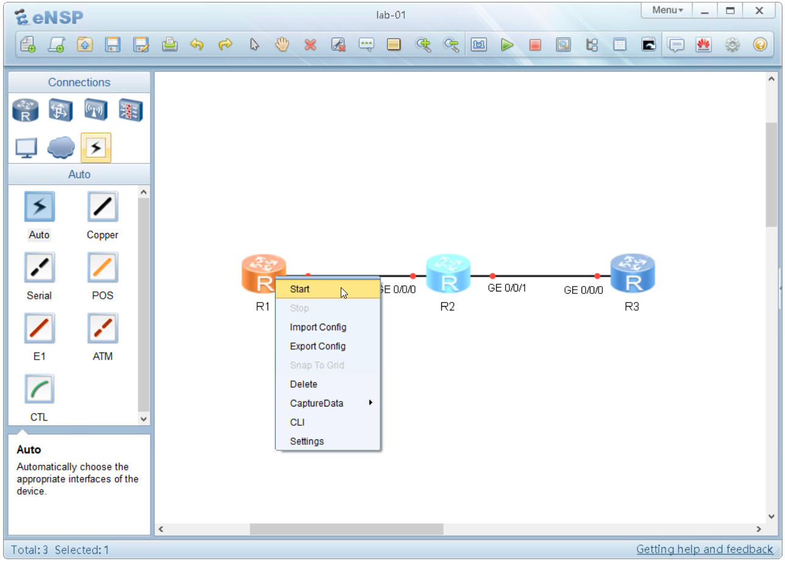

## Salvare la configurazione scritta nel dispositivo

Quando scrivi un comando su VRP, questa viene inserita in esecuzione nel runtime presente in **RAM**, ma non viene salvata automaticamente in memoria ritentiva **FLASH**.

Questo significa che al riavvio successivo quella configurazione non sarà presente.

Facciamo un semplice laboratorio per comprendere questo concetto:

Riprendi il lab01 realizzato nel modulo precedente in cui abbiamo parlato delle viste.

Entra nel terminale di R1 (doppio click) e cambia il nome del router con questi due comandi:

```text
<huawei>system-view
[huawei]sysname R1
[R1]
```
Hai certamente notato che il nome del router è cambiato da "huawei" a "R1".

Ora chiudi il terminale e poi ferma il router.

Per fermare il router devi premere sul router con il pulsante destro del mouse, 
e dal menù selezionare **stop**.



Poi accendi il router



Attendi qualche istante per permettere al router di potersi avviare e accedi alla console.

Noterai che il nome del router sarà tornato a quello di default

```text
<huawei>
```


