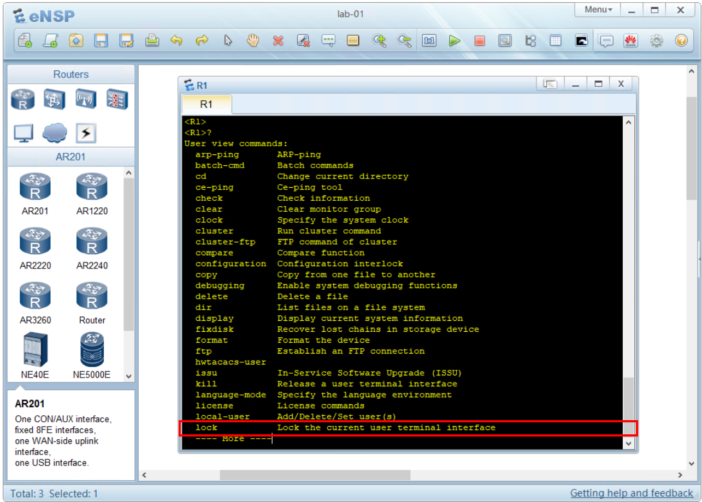
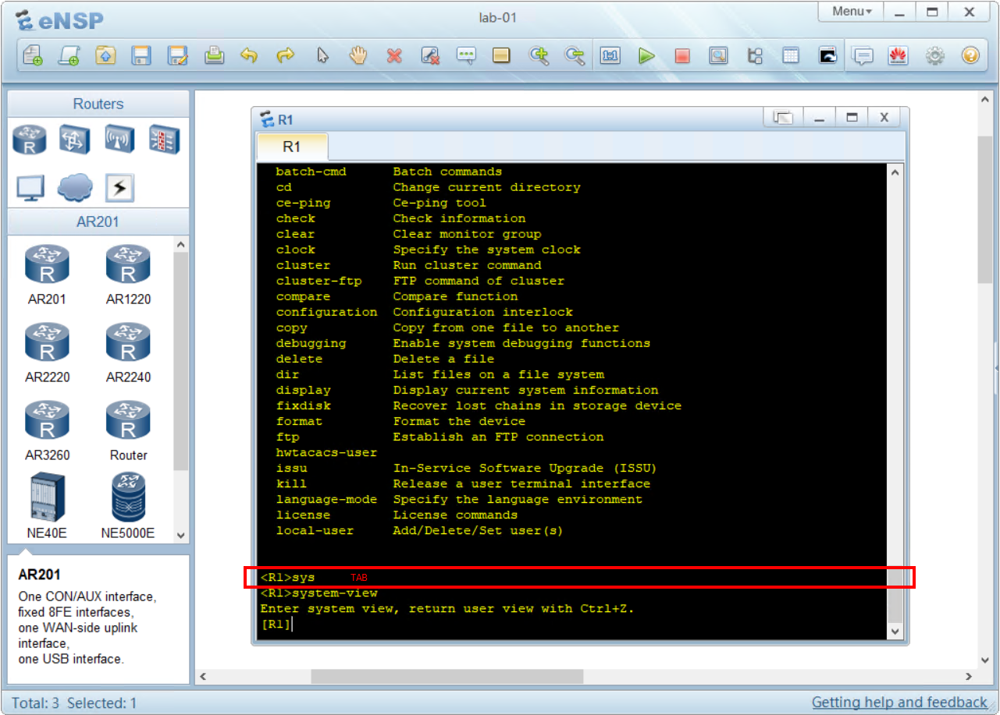
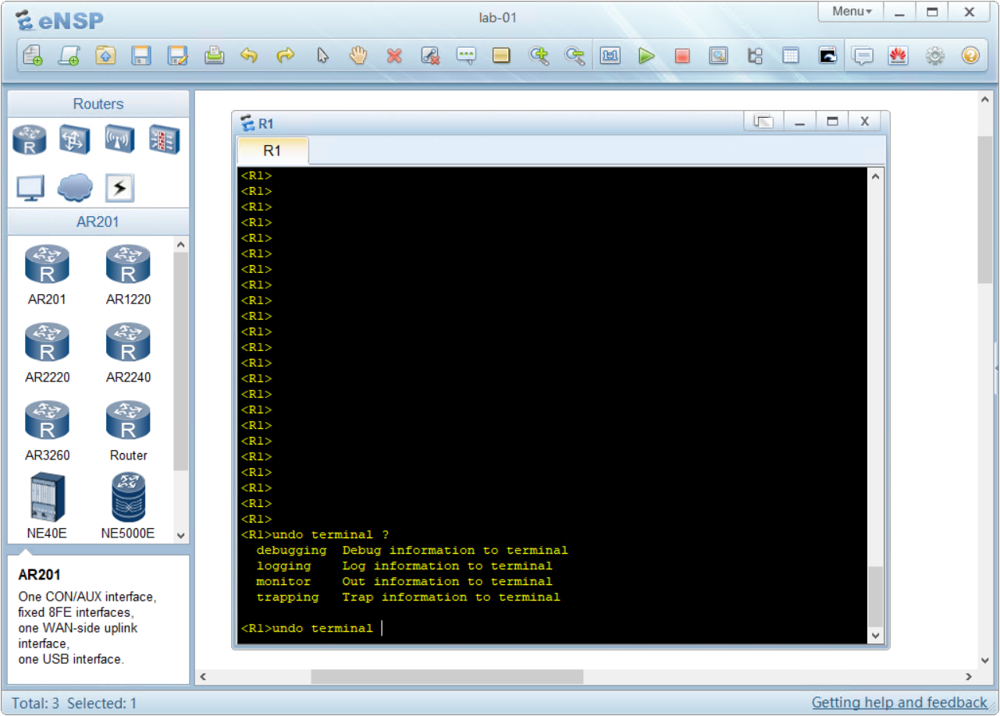
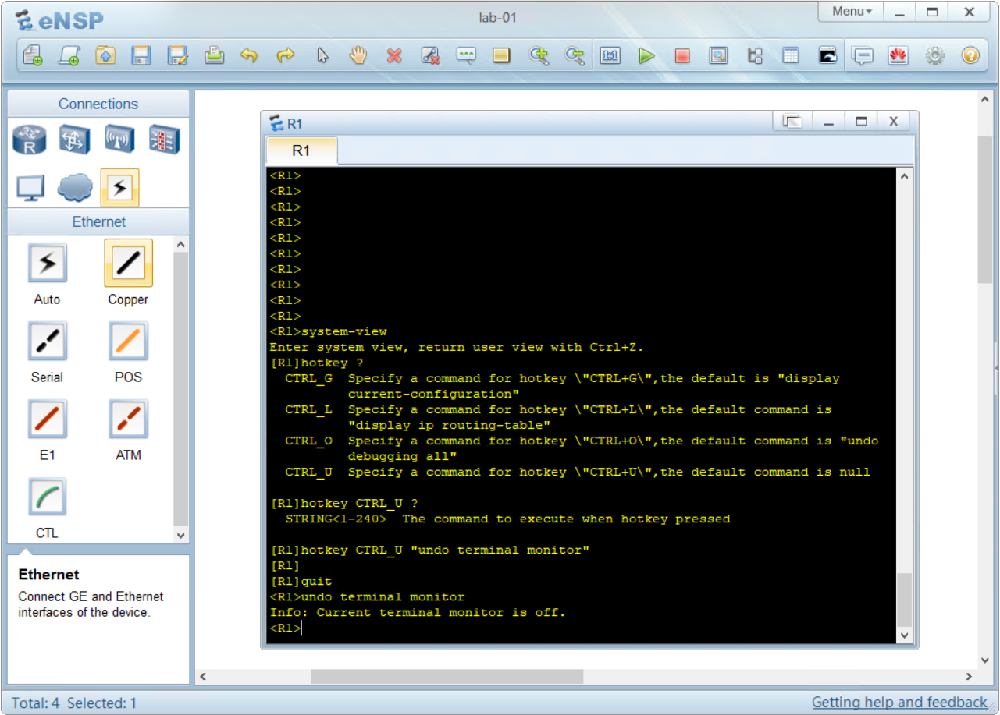

## Uso avanzato della CLI

Nei moduli precedenti non ho volutamente introdotto alcune scorciatoie e comandi rapidi della CLI per andare **"dritti al punto"** sugli argomenti di cui volevo parlarti e su cui dovevi costruire delle basi.

Ora possiamo analizzare alcuni aspetti avanzati di utilizzo della CLI.

L'uso della CLI può spaventare all'inizio.

Rispetto ad un'interfaccia grafica, come ad esempio una pagina web, dove l'occhio può trovare dei riferimenti su dei menù, la CLI ci chiede di pensare quello che stiamo scrivendo.

Per questo motivo è necessario fare un minimo di esercizio prima di acquisire confidenza con la CLI.

Posso garantirti che anche per me non è stato semplice all'inizio, ed è per questo motivo che ho pensato a questo corso Zero Huawei.

La CLI ha alcuni tasti che ci vengono in aiuto:

Il primo è il tasto **?**.

Premento il tasto ? in qualsiasi menù VRP ci stamperà la lista dei possibili comandi che possiamo utilizzare al suo interno.

Facciamo un laboratorio. Ritorna al lab01 e accedi al terminale di R1.

Dalla user-view premi il pulsante ? per richiamare l'help:

```text
<R1>?
```

Otterrai questo risultato:


Per visualizzare **la riga successiva** (1 sola riga) premi il tasto **ENTER**



Per visualizzare **le prossime 24 righe successive** premi il tasto **SPAZIO**


Per uscire (quit) dalla visualizzazione dell'help premi il tasto `q`


### Autocompletamento con il tasto TAB

Durante questi laboratori ti sarai accorto che scrivere i comandi per esteso può richiedere tempo.

Usando il tasto TAB possiamo chiedere alla CLI di completare la scrittura del comando che abbiamo iniziato.

Fai questo semplice laboratorio: 

partendo dalla *user-view* digita `sys` e poi premi il tasto **TAB**.



Come avrai potuto notare, la CLI ha completato il comando `system-view` in quanto era l'unico comando presente con quelle tre lettere iniziali.

### Errori nella scrittura dei comandi

La CLI segnala gli errori quando vengono digitati dei comandi errati.

Ad esempio, se dalla **user-view** provi a scrivere il comando `sysname R1` per impostare il nome al dispositivo, VRP risponderà con un errore:

```file
<R1>sysname R1
    ^
Error: Unrecognized command found at '^' position.
```

La CLI ha risposto dicendo "Errore: alla posizione segnalata con il carattere '^' è presente un comando non conosciuto/non valido.

Proviamo ora a scrivere un comando valido per la **user-view** ma con un parametro errato:

```file
<R1>undo terminal audio
                  ^
Error: Unrecognized command found at '^' position.
```

Il comando `undo terminal` è un comando conosciuto, ma il parametro **audio** è errato, ed è stato segnalato con il carattere '^' nella posizione dove si trova l'errore.

Come possiamo chiedere a VRP la lista delle opzioni valide?

Sempre con il punto di domanda **?**



### Scorciatoie da tastiera

La CLI di VRP include alcune scorciatoie da tastiera molto comode da utilizzare:

**?**
Stampa la lista di comandi o parametri disponibili

**TAB**
completa il comando/scorre tra le opzioni

**CTRL+Z**
permette di tornare alla user-view

**CTRL+C**
cancella l'operazione in esecuzione (ad esempio il comando ping)

**CTRL+X**
cancella i caratteri a sinistra del cursore. Se il cursore è alla fine della riga, cancella l'intera riga. Utile se si sta scrivendo un comando ma nella view errata. Cancellare una riga lunga con il backspace può essere un'operazione lunga.

**CTRL+A**
sposta il cursore all'inizio della riga (me lo ricordo con la A di "**A**ll'inizio"!)
*NOTA: dalla mia esperienza questo comando non funziona sul terminale di eNSP, ma funziona tramite telnet e SSH*

**CTRL+E**
sposta il cursore alla fine della della (me lo ricordo con la E di "alla fin**E**")
*NOTA: dalla mia esperienza questo comando non funziona sul terminale di eNSP, ma funziona tramite telnet e SSH*

**CTRL+D**
cancella il carattere sotto al cursore
*NOTA: dalla mia esperienza questo comando non funziona sul terminale di eNSP, ma funziona tramite telnet e SSH*

**CTRL+U**
cancella la riga intera (può essere personalizzato)

**CTRL+W**
cancella la parola a sinistra del cursore (CTRL+W Word=parola)

**freccia ↑ / ↓**
scorre la history dei comandi digitati

**freccia destra/sinistra**
sorre il cursore a destra e sinistra sulla riga

**CTRL+G**
è un comando personalizzabile. Di default esegue il comando `display current-configuration` e stampa la configurazione corrente.

**CTRL+L**
è un comando personalizzabile. Di default esegue il comando `display ip routing-table` e stampa il contenuto della tabella di routing.

**CTRL+O**
è un comando personalizzabile. Di default esegue il comando `undo debugging all` e annulla i messaggi di debug.

**CTRL+U**
è un comando personalizzabile. Di default non esegue alcun comando.

### Scorciatoie personalizzabili

È possibile configurare 4 scorciatoie:

- **CTRL+G**
- **CTRL+L**
- **CTRL+O**
- **CTRL+U**

Per cambiare l'azione da eseguire si utilizza il comando `hotkey` eseguito dalla system-view

```file
<R1>system-view
[R1]hotkey CTRL_U "undo terminal monitor"
```
poi verifica se la scorciatoia **CTRL+U** funziona correttamente. 
Esci dalla **system-view** con il comando `quit` e verifica se il terminal monitor viene disattivato.

```file
[R1]quit
<R1>undo terminal monitor
Info: Current terminal monitor is off.
```




