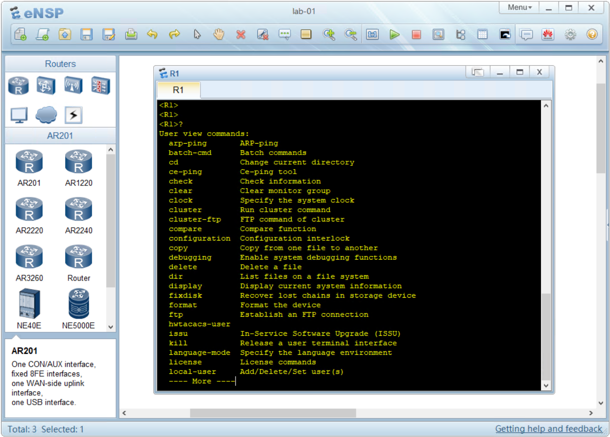
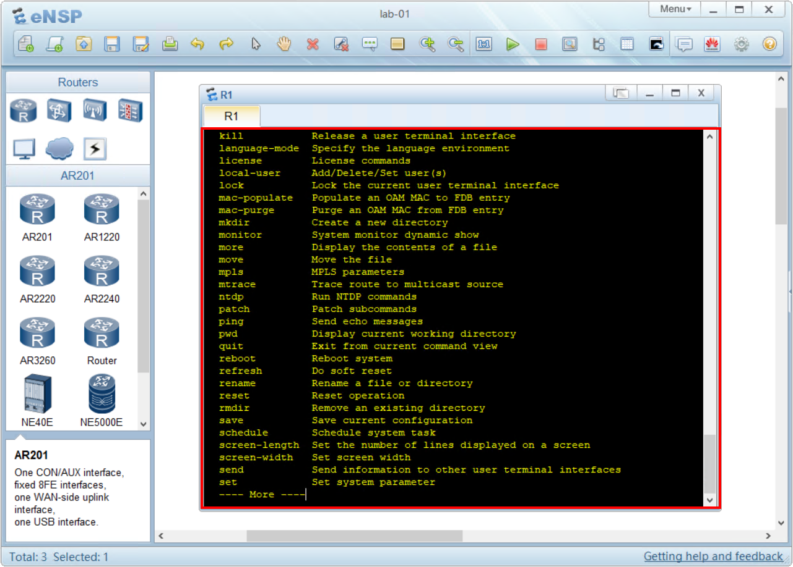
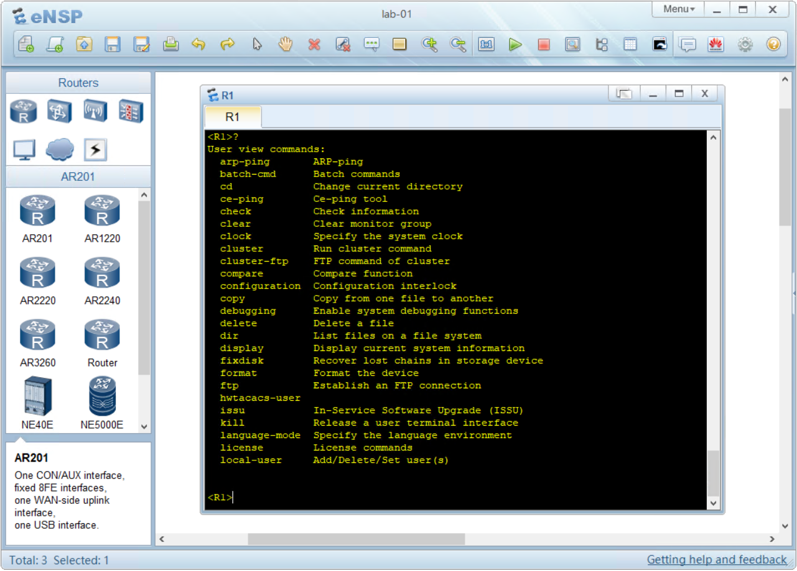

## Uso avanzato della CLI

Nei moduli precedenti non ho volutamente introdotto alcune scorciatoie e comandi rapidi della CLI per andare **"dritti al punto"** sugli argomenti di cui volevo parlarti e su cui dovevi costruire delle basi.

Ora possiamo analizzare alcuni aspetti avanzati di utilizzo della CLI.

L'uso della CLI può spaventare all'inizio.

Rispetto ad un'interfaccia grafica, come ad esempio una pagina web, dove l'occhio può trovare dei riferimenti su dei menù, la CLI ci chiede di pensare quello che stiamo scrivendo.

Per questo motivo è necessario fare un minimo di esercizio prima di acquisire confidenza con la CLI.

Posso garantirti che anche per me non è stato semplice all'inizio, ed è per questo motivo che ho pensato a questo corso Zero Huawei.

La CLI ha alcuni tasti che ci vengono in aiuto:

Il primo è il tasto **?**.

Premento il tasto ? in qualsiasi menù VRP ci stamperà la lista dei possibili comandi che possiamo utilizzare al suo interno.

Facciamo un laboratorio. Ritorna al lab01 e accedi al terminale di R1.

Dalla user-view premi il pulsante ? per richiamare l'help:

```text
<R1>?
```

Otterrai questo risultato:



Per visualizzare **la riga successiva** (1 sola riga) premi il tasto **ENTER**


Per visualizzare **le prossime 24 righe successive** premi il tasto **SPAZIO**



Per uscire (quit) dalla visualizzazione dell'help premi il tasto `q`




